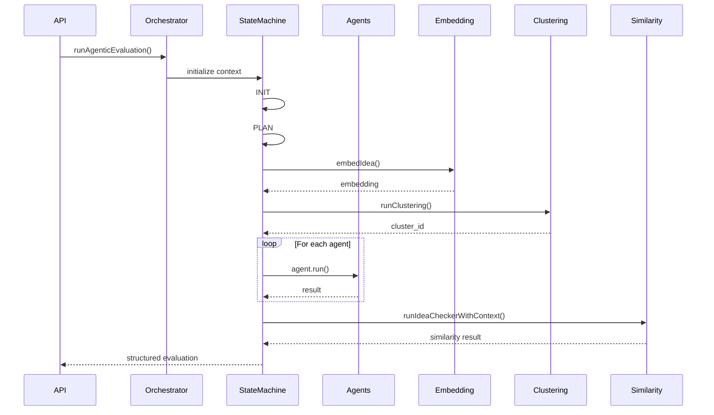

# 🧠 Agentic Idea Evaluation System

A modular, state-machine-driven AI evaluation engine that:

* Dynamically evaluates ideas using multiple specialized agents
* Performs semantic clustering
* Detects similarity across Deep Funding + SNET repositories
* Classifies ideas into categories and clusters
* Never allows one agent failure to break the pipeline
* Returns structured outputs for frontend persistence

This system is designed to be:

* Deterministic
* Extensible
* Challenge-aware
* Production-safe
* Rate-limit resilient

---

# 🏗 High-Level Architecture

The system is divided into four core layers:

1. **Controller Layer** – API entry
2. **Orchestrator Layer** – State machine + execution logic
3. **Agent Layer** – Specialized evaluation agents
4. **Similarity Engine Layer** – Cross-repository similarity detection

---

# 📂 Core Structure

```
/modules
  /orchestrator
    runAgenticEvaluation.js
    stateMachine.js
    /states
      init.js
      plan.js
      execute.js
      aggregate.js
      ideaCheck.js
      finalize.js

  /agents
    registry.js
    loader.js
    classification.js
    conceptual_feasibility.js
    technical_direction_clarity.js
    complexity_awareness.js
    scalability_potential.js
    context_awareness.js
    adoption_plausibility.js
    challenge_alignment.js
    ... (other focus agents)

  /creativity
    idea-checker.js
    idea-checker-adapter.js

/services
  genai.service.js

/utils
  index.js
```

---

# 🔁 Full Execution Flow

## Step 1 – API Call

Controller receives:

```json
{
  "new_idea": "<string>",
  "challengeConfig": { ... }
}
```

Controller calls:

```js
runAgenticEvaluation({
  new_idea,
  challengeConfig
})
```

---

## Step 2 – State Machine Initialization

`runAgenticEvaluation()` creates shared execution context:

```js
{
  new_idea,
  challengeConfig,
  plan: [],
  results: {},
  final: {},
  logs: []
}
```

Then initializes:

```js
new StateMachine(InitState, context)
```

---

# 🧭 State Machine

The evaluation follows this exact order:

```
INIT → PLAN → EXECUTE → AGGREGATE → IDEA_CHECKER → FINALIZE
```

Each state is isolated and transition-based.

---

# 🟢 INIT State

Purpose:

* Initialize clean evaluation context
* Log state entry

No heavy logic.

---

# 🟡 PLAN State

Purpose:

* Dynamically determine which agents to run.

Uses:

```js
ctx.challengeConfig.focus_areas
```

Agents are loaded dynamically:

```js
loadAgents(focusAreas)
```

Classification is always appended unless explicitly disabled.

Result:

```js
ctx.plan = [
  { agentId: "conceptual_feasibility", outputKey: "conceptual_feasibility_score" },
  ...
]
```

---

# 🔵 EXECUTE State

This is the most important state.

It performs two categories of operations:

---

## 1️⃣ Shared Infrastructure (Runs Once)

```js
embedIdea(new_idea)
runClustering(embedding)
```

Results stored in:

```js
ctx.results.embedding
ctx.results.cluster
```

These are reused later by:

* Similarity engine
* Classification output
* Final response

---

## 2️⃣ Agent Execution Loop

For each planned agent:

```js
for (const step of ctx.plan)
```

Each agent:

* Receives structured input
* Runs independently
* Returns structured result
* Cannot crash the evaluation
* Logs success or failure

Failure results in:

```js
ctx.final[outputKey] = null
```

---

## Special Handling – Classification Agent

Classification returns:

```js
{
  idea_category: string,
  idea_cluster: string
}
```

It does NOT return score.

Execute state attaches:

```js
ctx.final.idea_category
ctx.final.idea_cluster
```

---

# 🟣 AGGREGATE State

Purpose:

* Normalize outputs
* Ensure required infra fields exist
* Prepare for similarity check

Adds:

```js
ctx.final.embedding
ctx.final.cluster_id
ctx.final.idea_cluster (from clustering if available)
```

Logs collected `_score` fields.

---

# 🔴 IDEA_CHECKER State

Uses:

```
/creativity/idea-checker-adapter.js
```

This is a lightweight adapter version of the standalone idea checker.

It:

1. Fetches Deep + SNET idea corpus
2. Restricts to same cluster
3. Removes near-duplicate text
4. Computes cosine similarity
5. Converts to score
6. Applies threshold (<20 → null)
7. Optionally generates explanation

Returns:

```js
{
  similarity_score,
  most_similar_idea: {
    idea_id,
    similarity_score,
    explanation
  }
}
```

This state NEVER blocks evaluation.

---

# 🟤 FINALIZE State

Formats structured output:

```json
{
  "scores": { ... },
  "similarity": { ... },
  "classification": { ... },
  "infrastructure": { ... }
}
```

No database writes occur here.

Frontend persists.

---

# 🧠 Agents

All agents follow one of two contracts:

---

## 1️⃣ Scoring Agent Contract

Returns:

```js
{
  score: number,
  confidence: number
}
```

Score is normalized 0–100.

---

## 2️⃣ Classification Agent Contract

Returns:

```js
{
  idea_category: string,
  idea_cluster: string
}
```

No score.
No explanation.
Strict JSON.

---

# 📊 Supported Focus Areas

These must match exactly in `challengeConfig.focus_areas`:

```
conceptual_feasibility
technical_direction_clarity
complexity_awareness
scalability_potential
originality
depth_of_thinking
differentiation_logic
problem_definition_quality
problem_solution_alignment
potential_impact_directional
beneficiary_awareness
ethical_awareness
risk_awareness
regulatory_sensitivity
clarity_of_expression
logical_coherence
idea_stage_completeness
context_awareness
adoption_plausibility
challenge_alignment
classification
```

---

# 🔍 Standalone Idea Checker (Important)

Located in:

```
/creativity/idea-checker.js
```

This version:

* Builds unified corpus
* Ensures clustering exists
* Searches Deep Funding repository
* Searches SNET GitHub repositories
* Searches SNET Marketplace systems
* Generates explanations for similarity

The agentic flow reuses this logic via an adapter to prevent duplication.

---

# 🔁 Sequence Diagram – Full Evaluation



---

# 🛡 Design Guarantees

* Agent failure isolation
* Similarity failure isolation
* Cluster-restricted similarity
* Dynamic challenge-driven execution
* Deterministic classification
* No DB side-effects
* Full execution logs
* Frontend-controlled persistence

---

If you want next level:

* Internal architecture diagram
* Error-handling strategy documentation
* Rate-limit mitigation architecture
* Caching layer plan
* Observability strategy
* Production scaling blueprint

Tell me which direction.
